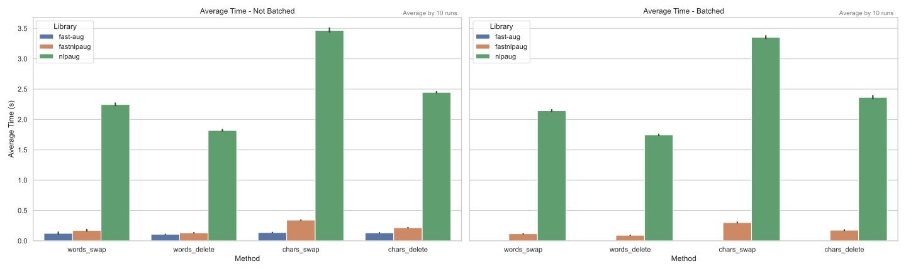
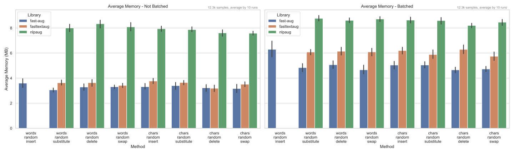

# fast-aug - python bindings

---

The `fast-aug` library **x25** times faster than `nlpaug`!

## Performance Comparison

Comparison of the `fast-aug` library with the other NLP augmentation libraries.

* `fast-aug` - this, Fast Augmentation library written in Rust, with Python bindings
* `nlpaug` - [nlpaug](https://github.com/makcedward/nlpaug) - The most popular NLP augmentation library
* `fasttextaug` - [fasttextaug](https://github.com/Tzinch21/fasttextaug) - re-write of some `nlpaug`'s augmenters in Rust with Python bindings
* `augly` not included as ["Our text augmentations use nlpaug as their backbone"](https://github.com/facebookresearch/AugLy/tree/main/augly/text)
* `augmenty` not included as it is too slow (2-8 times slower than `nlpaug`)

[//]: # (* for `augmenty` spacy model loading time is included, as we measure end-to-end time and mem &#40;`spacy.lang.en.English` model was used&#41;)

It is end-to-end comparison, including dataset loading, classes initialization and augmentation of all samples (one-by-one or provided as a list).  
See [./benchmarks/compare_text.py](./benchmarks/compare_text.py) for details of the comparison.

All libs compared on [tweeteval dataset](https://github.com/cardiffnlp/tweeteval) - sentiment test set - 12k samples.  
Note: dataset text file size is 1.1Mb, it is included in the memory usage.

## Development

Please see the GitHub repository README for mo info [fast-aug](https://github.com/k4black/fast-aug).

For building and profiling see `Makefile` in the project root.

TBA
