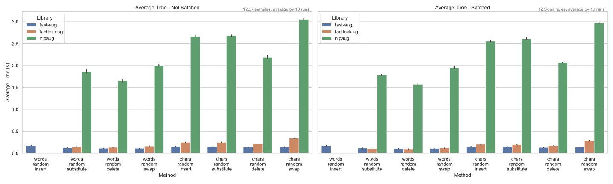

# fast-aug - python bindings

---

The `fast-aug` library **x25** times faster than `nlpaug`!

## Performance Comparison

Comparison of the `fast-aug` library with the other NLP augmentation libraries.  
All libs compared on [tweeteval dataset](https://github.com/cardiffnlp/tweeteval) - sentiment test set - 12k samples.

[//]: # (* for `augmenty` spacy model loading time is included, as we measure end-to-end time and mem &#40;`spacy.lang.en.English` model was used&#41;)
* `fastnlpaug` - is re-write of a couple of `nlpaug` augmenters in rust (not really developed)
* `augly` not included as ["Our text augmentations use nlpaug as their backbone"](https://github.com/facebookresearch/AugLy/tree/main/augly/text)
* Try to compare `augmenty`, but it way too slow, so we exclude it from the comparison (2 times slower than `nlpaug`)

See [./benchmarks/compare_text.py](./benchmarks/compare_text.py) for details.

## Development

Please see the GitHub repository README for mo info [fast-aug](https://github.com/k4black/fast-aug).

For building and profiling see `Makefile` in the project root.

TBA
